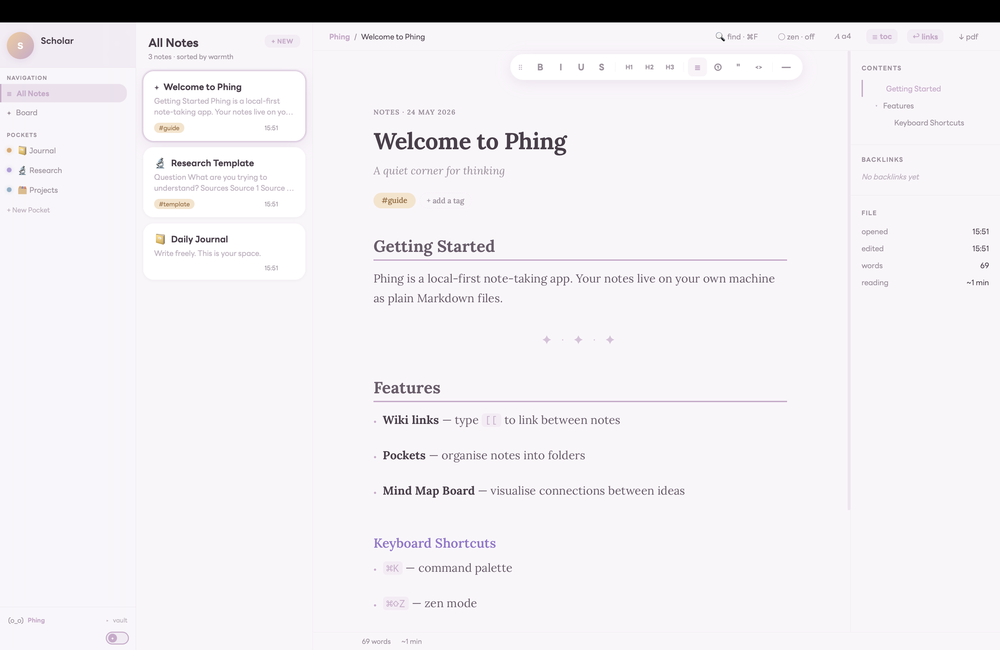
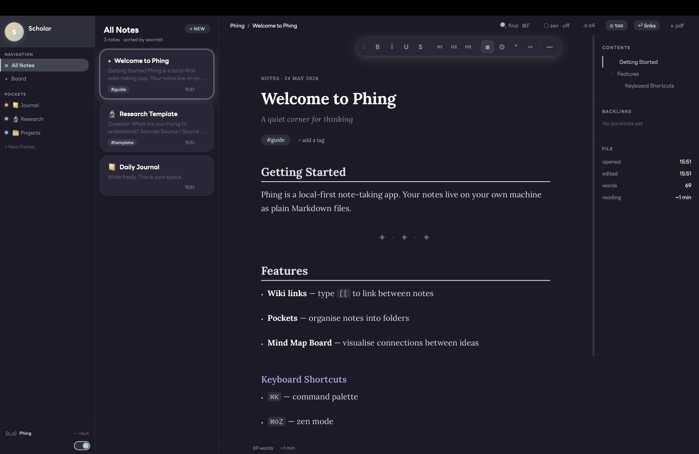
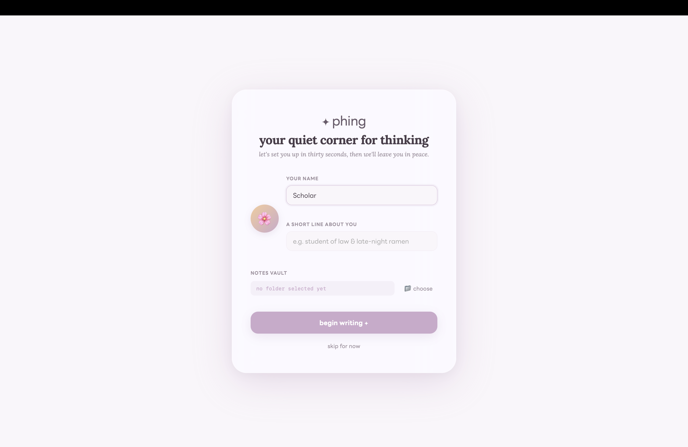
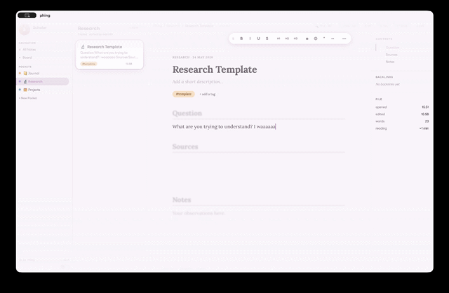
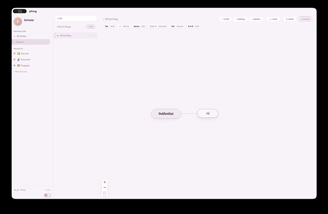

<div align="center">
  
  <h1>✨ phing</h1>
  <p><em>A writing-first markdown sanctuary designed to make thinking feel soft, calm, and uninterrupted.</em></p>
</div>

---

## 🌸 The Vision
Most productivity tools feel like databases. **Phing** is different. It is a local-first, deeply aesthetic knowledge manager built for researchers, writers, and students who want their digital workspace to feel as calming as a quiet desk with a cup of tea. 

Instead of overwhelming you with features, Phing focuses on **emotional UX**, robust typography, and an interface that respects your focus.

## 🖼️ Preview
<div align="center">
  <table style="border: none;">
    <tr>
      <td></td>
      <td></td>
    </tr>
    <tr>
      <td></td>
      <td></td>
    </tr>
  </table>
</div>

## ✨ Core Philosophy
* **☁️ Calm by Design:** Soft typography (Lora & LINE Seed), frosted glass aesthetics (`backdrop-filter`), and zero-latency Zen modes.
* **🔒 Bulletproof Trust:** Built on a rigorous local-first architecture. Atomic saves, recovery journals, and strict external file-watcher awareness mean your thoughts are never lost.
* **🧠 Visual Thinking:** A deeply integrated, automatically scaling Mind Map that acts as a cognitive tool, not just a navigation gimmick.
* **⌨️ Keyboard First:** Seamless Command Palette workflow to keep your hands on the keys.

## 🛠️ Tech Stack
Crafted with obsessive attention to detail using:
* **[Tauri](https://tauri.app/)** for a lightweight, native feel.
* **React & TypeScript** for the interactive surface.
* **Tiptap** for the robust markdown editing experience.
* **React Flow** for the node-based mind mapping.

## 🚀 Current State (v0.1.0-alpha)
* **Phase 1 (Reliability & Trust Layer): 🟢 Completed.** The core data architecture is rock-solid.
* **Phase 2 (Performance & Invisible Speed): 🟡 In Progress.** Currently optimising large mind map virtualisation and heavy UI dynamic disciplines.

---
<div align="center">
  <sub>Built with care by a Thai law student trying to survive late-night EU law research.</sub>
</div>

---
<details>
<summary><h2>⌨️ Features & Hotkeys (Click to expand)</h2></summary>

### 🌐 Global

| Hotkey | Action |
|---|---|
| `⌘K` | Open Command Palette |
| `⌘⇧M` | Toggle between Notes view ↔ Mind Map Board |
| `⌘N` | New note |
| `⌘⇧Z` | Toggle Zen mode |
| `⌘⇧A` | Toggle Academic mode (A4 paper layout) |
| `⌘⇧S` | Collapse / expand sidebar + note list panels |
| `⌘⇧B` | Toggle Backlinks panel |
| `⌘⌫` | Delete selected note (press twice within 3 seconds to confirm) |

### 📝 Notes & Editor

| Hotkey | Action |
|---|---|
| `⌘F` | Find in note |
| `Esc` | Close find bar |
| `⌘1` - `⌘5` | Toggle Heading 1 to 5 |
| `⌘-` | Insert horizontal rule |
| `[[` | Open wiki link suggestions |

*The floating formatting toolbar is draggable via the `⠿` handle (double-click to reset position).*

### 🧠 Mind Map Board (`⌘⇧M`)

| Hotkey | Action |
|---|---|
| `Tab` | Add child node |
| `↵ Enter` | Add sibling node |
| `Space` | Edit selected node's label |
| `↑ ↓ ← →` | Navigate between nodes |
| `Del` / `⌫` | Delete selected node |
| `⌘⇧N` | Open/close attached note pane |

### 🛡️ Data & Reliability (Under the hood)
* **Atomic writes:** Writes to `.md.tmp` first, preventing partial files on crash.
* **Recovery journal:** Snapshots previous disk content to `.phing/snapshots/` (max 10 versions).
* **File watcher:** Detects external changes and prompts a Conflict Dialogue (Reload / Keep local).

</details>

---

## ☕ Support the Project
Phing is a passion project built during late nights after law lectures. If this app helps you find your focus or brings a little peace to your digital workspace, consider supporting its development!

<div align="center">
  <a href="https://www.buymeacoffee.com/Umijun" target="_blank">
    
  </a>
</div>

<br>

**🇹🇭 สำหรับผู้ใช้งานชาวไทย (PromptPay):**<br>
หากน้องผิงช่วยให้การจดโน้ตหรือการค้นคว้าของคุณราบรื่นและสงบขึ้น สามารถสนับสนุนค่ากาแฟเล็กๆ น้อยๆ ผ่านการสแกนคิวอาร์โค้ดด้านล่างได้เลยนะคะ ขอบคุณที่เอ็นดูโปรเจกต์นี้ค่ะ 💖

<div align="center">
  
</div>

---

## 🍎 Note for macOS Users

If you encounter a 'damaged and cannot be opened' error when launching the app, this is due to macOS Gatekeeper blocking applications not signed with an Apple Developer Certificate. You can safely bypass this by running the following command in your Terminal:

```bash
xattr -cr /Applications/phing.app
```
(Please ensure the app is moved to your /Applications folder before running this command.)

---
## 🌸 License
Phing is open-sourced software generously licensed under the [MIT license](LICENSE). Feel free to use, modify, and build upon it to create your own peaceful workspace!
